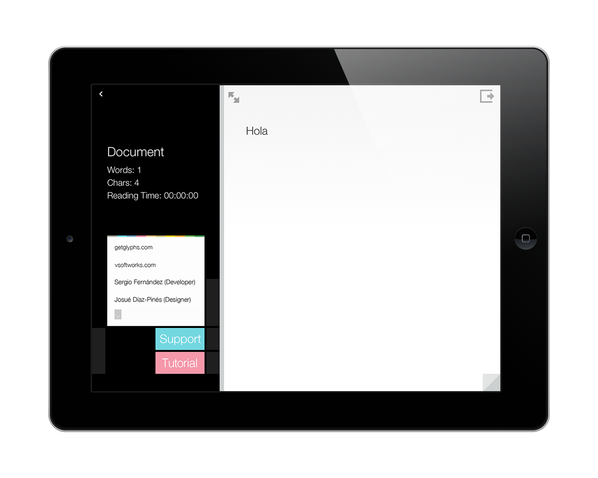

# [fit] Zero to Hero 
### ironhack

---

## **Hi! I'm Sergio**
#### @fdzsergio

---


---

2011

---

Apple approved its **500,000**th app

---

### **500,000**

---

## **500,000**

---

# **500,000**

---

# [fit] **500,000**

---

start from *scratch*

---

there's no need to reinvent the *wheel*

---

> Good artists copy.
> Great artists steal.
-- Pablo Picasso

---

#😎

---

# [fit] **Unicode**

---

→ › 〜 ¥ ☀ ∙ ¬ ∫ © 

---


---

# [fit] Awesome
# **Pretty** + _Simple_

---


---


---


---


---

# 2.0

---


---


---



---

# _Failures_


---

# [fit] `SymbolViewController`
### 1220 lines

---

# Singleton Dependency

```objc
- (id)initWithNibName:(NSString *)nibNameOrNil bundle:(NSBundle *)nibBundleOrNil
{
    self = [super initWithNibName:nibNameOrNil bundle:nibBundleOrNil];
    if (self) {
        // Custom initialization
        AppDelegate *mainDelegate = (AppDelegate *) [[UIApplication sharedApplication] delegate];
        self.doc = mainDelegate.document;
    }
    return self;
}
```

---

# Properties with Wrong Attributes

```objc
@property (nonatomic, strong) IBOutlet UITableView *tableView;
@property (nonatomic, strong) IBOutlet UIToolbar *toolbar;
@property (nonatomic, strong) IBOutlet VSDocument *document;
```

---


---

# **SUCCESS**

---

# Glyphs was featured on

* _AppStore_ as **App of the Week**
* _AppStorm_ as **Best Advanced Markdown Editor**
* _AppleWeblog_ as **Best App for iPhone 2011**
* _appgratis_ as **App Of The Day**

---

# Key elements

* _UICollectionView_ on iOS 4
* Crash _Free_
* Accessibility
* Localized
* **Sweet** Animations
* Fresh **Design**

---

# **Thank You**

---

# Questions?
### _@fdzsergio_
